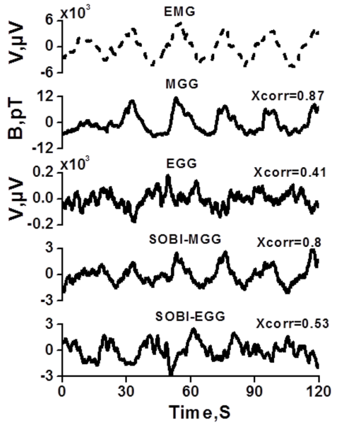
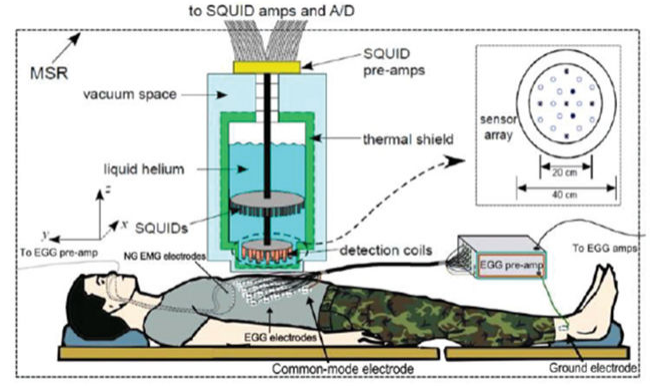
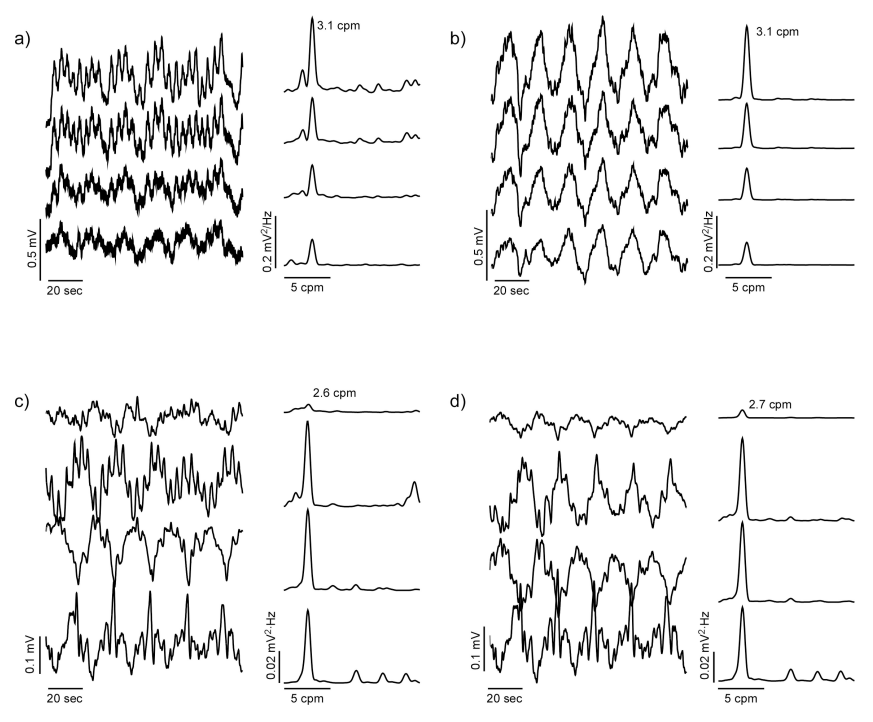
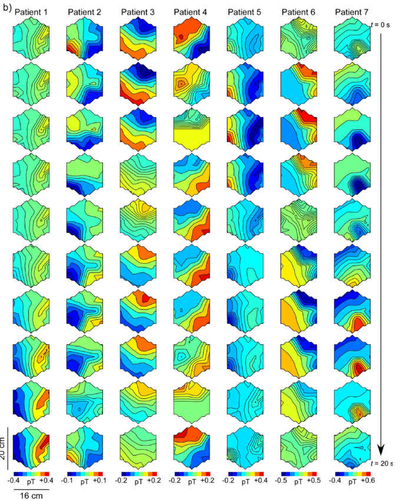

- [valid information](#valid-information)
  - [胃部生物信号](#胃部生物信号)
    - [胃慢波 gastric slow wave](#胃慢波-gastric-slow-wave)
    - [胃磁图MGG magnetogastrogram](#胃磁图mgg-magnetogastrogram)
- [实验性论文组1（范德比尔特大学 Vanderbilt University）](#实验性论文组1范德比尔特大学-vanderbilt-university)
  - [An integrative software package for gastrointestinal biomagnetic data acquisition and analysis using SQUID magnetometers，Neurogastroenterology and Motility， 2006](#an-integrative-software-package-for-gastrointestinal-biomagnetic-data-acquisition-and-analysis-using-squid-magnetometersneurogastroenterology-and-motility-2006)
    - [Objective](#objective)
    - [procedure](#procedure)
    - [结论](#结论)
  - [Comparison of conventional filtering and independent component analysis for artifact reduction in simultaneous gastric EMG and magnetogastrography from porcines\[J\]. IEEE Transactions on Biomedical Engineering, 2009](#comparison-of-conventional-filtering-and-independent-component-analysis-for-artifact-reduction-in-simultaneous-gastric-emg-and-magnetogastrography-from-porcinesj-ieee-transactions-on-biomedical-engineering-2009)
    - [Objective](#objective-1)
    - [procedure](#procedure-1)
    - [signal process](#signal-process)
    - [results](#results)
  - [Biomagnetic and bioelectric detection of gastric slow wave activity in normal human subjects – a correlation study，Physiol Meas. 2012](#biomagnetic-and-bioelectric-detection-of-gastric-slow-wave-activity-in-normal-human-subjects--a-correlation-studyphysiol-meas-2012)
    - [Object](#object)
    - [procedure](#procedure-2)
    - [signal process](#signal-process-1)
    - [results](#results-1)
  - [Noninvasive magnetogastrography detects erythromycininduced effects on the gastric slow wave,  IEEE Transactions on Biomedical Engineering, 2018](#noninvasive-magnetogastrography-detects-erythromycininduced-effects-on-the-gastric-slow-wave--ieee-transactions-on-biomedical-engineering-2018)
    - [Objective](#objective-2)
    - [Procedure](#procedure-3)
    - [signal process](#signal-process-2)
    - [结论](#结论-1)
  - [gastroparesis alters the biomagnetic signature of the gastric slow wave\[J\]. Neurogastroenterology \& Motility, 2016](#gastroparesis-alters-the-biomagnetic-signature-of-the-gastric-slow-wavej-neurogastroenterology--motility-2016)
    - [Objective](#objective-3)
    - [Procedure](#procedure-4)
    - [Result](#result)
  - [Diabetic gastroparesis alters the biomagnetic signature of the gastric slow wave\[J\]. Neurogastroenterology \& Motility, 2016](#diabetic-gastroparesis-alters-the-biomagnetic-signature-of-the-gastric-slow-wavej-neurogastroenterology--motility-2016)
    - [Objective](#objective-4)
    - [Procedure](#procedure-5)
    - [Results](#results-2)
      - [freq](#freq)
      - [propagation](#propagation)
  - [总结](#总结)
  - [常见信号处理方法](#常见信号处理方法)
    - [统计显著性 statistical significance](#统计显著性-statistical-significance)
# valid information
## 胃部生物信号

因已经有研究证明可以从胃肠道慢波信号的分析中检测出胃器官的各种病理状况，胃电控制活动(ECA，electrical control activity)的研究引起了医学领域极大的兴趣。美国一所大学（范德比尔特大学）的数据显示尽管超过6000万美国人受到消化系统疾病的影响，**但与之相关的电生理机制胃肠道系统的病理状况在论文发表前后（2006）才刚刚开始被了解**。例如胃轻瘫，其特征是胃排空速度异常缓慢，消化不良，恶心，不适和间歇性呕吐。过去也有许多研究使用胃电图(EGG)和胃磁图(MGG)来检测与胃轻瘫和缺血等疾病相关的现象。同时考虑到急性肠系膜缺血(包括肠系膜静脉血栓形成(MVT))患者的死亡率至少为50%，所以这类研究的重要性可见一斑。

胃慢波于1921年首次记录，是一种生物物理现象，它起源于胃的主体，在人体中以**去极化/再极化波前**的形式向幽门方向传播，频率为每分钟3 - 4个周期(cpm)。电传播是由平滑肌实现的，平滑肌由几层耦合细胞组成，这些细胞允许极化波穿过胃直到到达幽门。此时，在新周期开始之前，传播将重置到主体区域。

由于胃肠道生物电流传播的异常与疾病状态有关，因此在无创检测它们的方向上投入了大量的研究工作。用于ECA的三种方法是肌电图（EMG）、胃电图(EGG)和胃磁图(MGG)。EMG和EGG包括使用电极记录由ECA引起的生物电场。EMG电极直接放置在浆膜上的方式这使得这项技术具有严格的侵入性。在EGG的情况下，电极附着在腹部皮肤上。EMG的信噪比较好而EGG的信噪比较差。EGG方法相关的一些固有困难——例如**电信号的recording赖于组织电导率**等限制会减弱EGG信号准确度。但对于人体研究，EMG可能无法在手术室外获得，而EGG记录的可靠性较低。

因此设计了第三种技术即MGG。MGG是EMG和EGG的合适替代方案，因为它涉及到将磁力计无创地定位在靠近腹部的位置，以检测ECA电流产生的生物磁场。通过MGG无创测量生物磁场比通过EGG无创测量生物电场更有利，因为磁场强烈依赖于组织的通透性，几乎等同于自由空间的通透性。另一方面，生物电场主要取决于组织介电常数，在EGG的情况下，这会在ECA源和测量仪器之间产生筛选效应。由于MGG是非侵入性的，其信噪比可与侵入性EMG相媲美，因此即使在手术室外，也可以从人类患者身上获得ECA的磁场记录，效果良好。因为磁场依赖于组织的磁导率，这几乎等于自由空间的磁导率。研究发现，**尽管磁场强度随着距离源的距离而迅速下降，但它们确实以更准确的方式揭示了这些源的特征**。由于胃生物磁场的强度非常弱，约为$10^{-12} T$量级（皮特），因此需要高灵敏度的仪器也就是超导量子干涉装置(SQUID)生物磁强计。迄今为止，它仍然是检测和测量极低量级磁场的最灵敏的设备之一。

### 胃慢波 gastric slow wave

胃慢波是一种在胃中无所不在的节律性活动，胃中食物的混合和推进就是由胃肌肉组织的慢波介导的。正常人的频率约为每分钟3个周期，**位于胃肌肉组织**内的Cajal间质细胞(ICCs)是慢波的发起者和传播者。icc通过间隙连接与纵向和圆形肌肉层电偶联，电活动被动地通过这些层传播，**沿着中上体的大曲率向幽门传播(顺行传播)**。胃的某些疾病障碍，如胃轻瘫和功能性消化不良等问题可改变胃慢波活动的时空参数，这使胃慢波具有较高的医学研究价值。之前的EGG研究主要评估了胃慢波的**主导频率(DF)**、**胃慢波在正常频率范围内的百分比**以及**胃慢、胃常和胃快频率范围内的功率分布百分比(PPD)**。此外，**慢波耦合百分比(%SWC)**通过比较相邻EGG电极记录的慢波频率来评估胃合胞体中耦合的完整性，最近的一项研究表明，%SWC是一项可以稳定的EGG参数，具有足够的临床研究重复性。

### 胃磁图MGG magnetogastrogram
胃电图(EGG)记录与胃慢波相关的皮肤电位，其频率已被证明反映了潜在的浆膜电活动。然而，**具有高低电导交替的腹部层扭曲和衰减了电位中的时间和相位信息**，因此只能可靠地记录**时间动态**。另一个技术，大多数用于检测胃慢波活动的肌电图(EMG)技术要么涉及在腹部手术期间将浆膜电极放置在胃表面，要么将腔内电极连接到胃粘膜。进入胃肠道的困难限制了侵入性肌电图技术用于记录胃慢波活动的潜在应用。

胃磁图(MGG)也用于测量与EGG相同目标的电活动，但不像电势那样受组织电导率的影响。胃慢波可产生细胞外磁场，这种磁场可以用超导量子干涉装置(SQUID)磁力计在胃磁图(MGG)中测量。对于MGG信号，用快速傅里叶变换(FFT)后，若主要是正弦信号，且主要频率在胃慢波范围内(2.5-4.0 cpm)，则被归类为胃慢波信号。除了慢波的时间动态外，MGG还保留了来自空间分离的胃源的慢波信号的相位特征，从而可以表征传播。

# 实验性论文组1（范德比尔特大学 Vanderbilt University）
## An integrative software package for gastrointestinal biomagnetic data acquisition and analysis using SQUID magnetometers，Neurogastroenterology and Motility， 2006
### Objective
为了解决许多研究人员和临床医生在这一重要研究领域对强大的采集和分析软件工具的迫切需求，该论文描述了一个集成的模块化计算机程序的研制，用于采集、处理和分析GI SQUID信号。除了用于高效数据采集的强大硬件实现外，还开发了许多信号处理和分析模块，以服务于各种临床程序和科学研究。实现的软件功能包括数据处理和可视化、信号频谱的瀑布图以及GI信号频率的空间图。此外，另有介绍一个用人体躯干和内部器官的现实模型创建的工具，可提供强大的三维可视化的GI信号。
### procedure
Tristan 637i磁力计有五个线圈，用于记录x方向上的磁场梯度，还有五个线圈用于y方向。此外，有19个轴向线圈用于测量z方向的梯度。总计29个超导线圈呈两个同心圆共面六边形分布，如下图所示，记录的量为$ΔB/Δz$。另外10个这样的输入通道也与其他通道位于同一平面，每个通道中有5个分别用于记录$ΔB/Δx$和$ΔB/△y$。SQUID的29 z通道测量与传感器外表面垂直的分量.仅在五个位置测量磁场的所有三个分量，从而可以确定磁场的方向及其在这些特定位置的大小。论文软件采用的计算机具有1gb RAM，使用两个PCI 6031E 16位数据采集卡以及两个SCB-100连接器块（TI）。数据采集卡由内部虚拟仪器(VI)例程控制，使用Labview 6.0搭建。

使用有限脉冲响应(FIR)滤波器，以30 Hz的截止频率对采集的数据进行低通滤波。由于存储容量问题，以SQUID的3mhz的速度向磁盘写入数据不可能的;所以在数据保存之前，采集的数据被采样10倍，有效采样率因此降低到3 kHz。

该程序的第一个独立单元——数据采集模块，负责控制数据采集、模拟滤波和数字二进制格式的存储。该模块采用LabView设计，具有友好的图形用户界面，可以方便、高效地获取数据。第二个单元是数据处理和分析模块，它提供了一些重要的计算和可视化工具，这些工具在GI磁信号分析中非常常用。这些工具包括数据显示和滤波、GI信号中幂级数分布的时频表示(TFRs)和SQUID数据频率图。该模块采用MatLab编程语言实现。该程序的第三个单元包含人体躯干和内部器官的三维(3D)现实模型。在该模型中，SQUID测量的磁场分量在记录位置以3D形式显示，重建的胃体直接呈现在磁力计通道阵列的下方。最后一个模块是使用新西兰奥克兰大学生物工程研究所的CMISS模拟程序设计的。

下图为数据采集模块，纵坐标为自适应拉伸

下图为在可视化模块中，样本滤波后SQUID z通道的空间数据显示。

下图为使用空间通道排列显示模式生成的示例时频瀑布图，可见主导频率为3 cpm

下图为样本频率图。使用数据网格插值算法连续表示生物磁强计输入线圈**空间范围内的频率数据**。以每分钟为一个周期，频率被划分为若干个间隔并使用相应的频率数据来生成频率图。一组频率图对应于SQUID输入数据文件中包含的**一分钟的GI电活动**。在下图中，在3-4 cpm范围内信号幅度最大。所有图都是按照相同的比例绘制的，从色条可以看出绘制的PSD（功率谱密度）值是无量纲的。

下图为从CMISS模拟中获得的透视图

### 结论
作者表示，论文描述的软件标志着改善胃肠道临床诊断的积极一步。到2006为止，GI生物磁学研究领域的软件开发很少，因此论文的模块化程序有助于将MGG建立为一种值得信赖的研究方法。迄今为止，使用瀑布图和频率图进行GI数据分析已成为许多生理学研究的标准方法。另一方面，CMISS可视化工具对于GI系统的建模来说是比较新颖的，尽管它大量借鉴了可用于心脏建模和仿真的类似方法的思想和特征。

## Comparison of conventional filtering and independent component analysis for artifact reduction in simultaneous gastric EMG and magnetogastrography from porcines[J]. IEEE Transactions on Biomedical Engineering, 2009
### Objective
论文进行了独立分量分析(ICA)和传统滤波(CF)的比较研究，目的是减少同时胃肌电图（EMG）和胃磁图(MGG)的伪影。采用浆膜电极(EMG)和超导量子干涉装置生物磁强计(MGG)同时记录10只麻醉猪的EMG/MGG数据。使用ICA和CF对MGG波形进行分析表明，ICA在从MGG记录中提取呼吸和心脏伪影的能力优于CF方法。还使用瀑布图对ica和cf处理的数据进行了信号频率分析，确定这两种方法产生的结果在质量上可比较。通过同时使用肌电图/ MGG，论文能够通过“猪”模型内的比较和交叉验证来证明论文结果的准确性和可信度。

### procedure
数据采集采用MGG和EMG两种技术。第一个是范德比尔特大学GI SQUID技术(VU-GIST)实验室的多通道637i SQUID生物磁强计(Tristan Technologies, Inc.， San Diego, CA)，检测线圈以梯度仪的形式布置成一个水平网格，其中19个网格记录了相对于网格平面(B)的磁场直角分量。在这19个位置中的5个位置，也测量了磁场的另外两个直角分量(By和By)。

论文方案得到了范德比尔特大学机构动物护理和使用委员会(VU-IACUC)的批准。在论文的实验中，受试者（猪）水平躺在磁屏蔽室(Amuneal Manufacturing Corporation, Philadelphia, PA)的SQUID下。该磁力计定向使测量信号的x分量和y分量(与体表相切)的线圈在矢状面和水平面上定向，而测量z分量(与体表法线)的线圈在正面向上定向。

用于EMG数据采集的括18个电极连接到一个隔离的生物电放大器,其中12个电极被人工贴在10头禁食、麻醉的健康猪的皮肤上，每头猪体重约为20-25公斤，这些猪被水平放置在磁屏蔽室内的SQUID下面。初始麻醉包括静脉注射泰拉唑、氯胺酮和噻嗪，每种浓度为100mg /mL。给药剂量为:特拉唑4.4 mg/kg，氯胺酮2.2 mg/kg，噻嗪2.2 mg/kg。动物插管并维持浓度为2%的异氟醚麻醉。呼吸传感器被放置在每头猪的嘴和鼻子上。EMG数据通过LabVIEW软件接口获取，采样频率为3 kHz，采样至300 Hz。论文实验同时获得了持续15分钟的肌电图/MGG数据。为了研究和比较CF和ICA从数据中减少呼吸伪影的能力，在记录过程中诱导了两次l min屏气。屏气的诱导是通过暂停由插管器维持的人工呼吸来完成的。

### signal process
论文分别采用CF（传统滤波）和ICA两种数据分析方法进行比较。CF分析包括带通，二阶巴特沃斯滤波器。巴特沃斯滤波器减少了通带波纹在信号的影响，使用的滤波窗口为$[1/2, 15]$ cpm。

### results
论文使用CF和ICA获得的波形的第一个比较分析如下图所示，同时显示了记录时间为1分钟的EMG/MGG数据。选择了两种不同的片段，即在屏气期间获得的片段(第一列)和在呼吸期间获得的片段(第二列)。对于在屏气期间获得的原始数据(左上)没有呼吸伪影可见，最容易识别的伪影是心脏源性的，频率约为80cpm。此伪影仅在MGG数据中可见(连续黑色线中的高频部分)，而肌电原始信号(虚线红色)不受心脏的影响，其原因是肌电信号主要是由传感器附近的源产生的，由于电极信号在很大程度上取决于组织的导电性，远离记录部位的电信号来源对EMG贡献较小，而MGG信号会受到更远的源影响。

在MGG的情况下，信号的质量和强度取决于组织的通透性，这与自由空间的结论非常接近。这就是为什么在经典的实验中，尽管SQUID线圈比电极离源更远(后者直接贴在胃外表面)，但MGG信号相比于肌电图信号对心脏活动更敏感。在屏气期间获得的原始数据段(左上)可以与呼吸期间获得的原始数据段(右上)进行比较。在后者中，呼吸伪影在MGG的情况下在大约32 cpm的频率下清晰可见。一般来说，每只动物的呼吸频率在27-35 cpm之间。心脏伪影也出现在图中，尽管其振幅较低。没有发现任何受试者的肌电图信号明显受到呼吸的影响，这一发现也在图中得到了说明。这种现象是由于电极相对于胃电源的相对位置在呼吸过程中保持不变，而对于MGG却并非如此。因此，无论是在呼吸过程中还是在屏气过程中获得的肌电图信号性质基本保持不变。

上图的第二行为CF处理后的EMG和MGG信号。在EMG下屏气和呼吸数据的结果非常相似，而在MGG的情况下存在很大的差异。首先可得出CF方法不能以令人满意的方式去除呼吸伪影，如右中图所示。其次，屏气过程中EMG和MGG处理信号的相关性比呼吸过程中的二者更强。所有样本进行CF处理后，EMG和MGG信号之间的相关系数首先使用Fisher z变换进行计算，z值如下（平均值，标准差）
- 屏息：0.933,0.134
- 呼吸：0.124,0.089

进行ICA处理后的z值如下
- 屏息：0,836,0.035
- 呼吸：0.764,0.071

综上所述，上图表明，ICA可能至少在两个方面优于CF，使用两种方法获得的信号之间的一致性(相关性)以及从MGG数据中最小化呼吸伪影的能力。
    
下图用于比较CF和ICA的伪影去除能力(即信号处理方法的比较)。原始信号显示为连续线(黑色线，顶部)，滤波信号显示为虚线(红色线，中间)，ICA处理的信号显示为虚线(蓝色线，底部)。左列显示在屏气期间获得的数据，右列显示在呼吸期间获得的数据。显示的时间间隔都是1分钟。第一列显示MGG数据，第二列显示EMG数据。

下图为上两幅图EMG/MGG频率分析结果。MGG谱显示为连续线(黑色在线)，而EMG谱显示为虚线(红色在线)。左列显示在屏气期间获得的数据，而右列显示在呼吸期间获得的数据。第一行显示原始数据的光谱，第二行显示滤波数据的光谱，第三行显示ica处理数据的光谱。横轴上的单位是赫兹，而纵轴表示功率，以$pT^2/Hz$为单位。在频域方面，CF和ICA在识别肌电图的主导频率方面表现相当。而ICA的MGG谱(第三行，右)与原始MGG谱(第一行，右)的良好一致性说明了ICA显然更适合于呼吸过程。

最后是同步EMG和EGG的瀑布图比较。第一列显示MGG结果，第二列显示EMG结果。第一行是CF处理的数据，第二行是经过ica处理的数据。显示的频率范围为0-40 cpm。

## Biomagnetic and bioelectric detection of gastric slow wave activity in normal human subjects – a correlation study，Physiol Meas. 2012
### Object
论文用超导量子干涉装置(SQUID)磁强计、粘膜电极和皮肤电极同时测量了18名正常人(11名女性和7名男性)的胃慢波活动。论文使用傅立叶谱分析和SOBI盲源分离技术对信号进行处理,观察到粘膜肌电图(EMG)和多通道SQUID胃磁图(MGG)之间的波形高度相关。粘膜肌电图与皮肤胃电图(EGG)波形相关性较低，但应用SOBI后相关性提高。在MGG和粘膜电极记录的电活动频率之间也有很高的相关性(r = 0.97)。论文得出结论，SQUID磁强计无创记录的胃慢波活动与有创粘膜电极记录的活动高度相关.
### procedure
在本研究中，论文使用粘膜吸电极记录粘膜肌电图(EMG)。其包括一个定制的八通道粘膜电极阵列，集成在直径4.5 mm的鼻胃(NG)导管中(Dentsleeve International, USA)。电极为同轴安装在导管上的铂环，如图1所示。4毫米长的电极沿NG导管每1.5厘米间隔。论文使用的皮肤电极(16对双极电极)是标准的贝克曼银-氯化银烧结生物电位电极，杯大小为17毫米，填充电液。

对于MGG利用特里斯坦637型超导量子干涉装置(SQUID)磁强计记录了多通道MGG。SQUID在一个六边形紧密排列的阵列中有19个正常分量传感器，当受试者躺在设备下面时，这些传感器可以测量垂直于体表的磁场。十个额外的传感器测量磁场的切向分量，分别位于正常分量传感器阵列的顶部、底部、侧面和中间。在采集过程中，SQUID和电极信号时间同步。18名正常志愿者(11名女性和7名男性)在禁食一夜后到范德比尔特综合临床资源中心(GCRC)报到。这些志愿者之前都没有胃肠道疾病或手术史，也没有人服用过已知会改变胃肠道运动或电活动的药物。在入组前对有生育能力的妇女进行妊娠试验。所有的研究都经过范德比尔特人类受试者保护委员会的审查和批准。论文将鼻胃粘膜肌电管(NG管)沿胃大弯曲放置于幽门-胃窦区。然后，论文通过x射线验证了NG管电极在胃窦的适当放置，另外皮肤EGG的电极平台由4排4对双极电极组成。论文将皮肤电极沿纵轴放置在腹部胃上方。然后，志愿者们被放置在一个磁屏蔽房间的SQUID磁力计下面。在禁食30分钟期间，同时记录粘膜肌电图、EGG和MGG数据。然后，志愿者们用一种透明的液体(水)吃了一顿标准的300千卡的火鸡三明治。饭后，论文记录了一小时的餐后信号。在数据收集过程中，研究人员多次要求受试者暂停呼吸，以便对降噪技术进行比较。

### signal process
为了研究多通道MGG是否反映了正常人的潜在慢波活动，论文对同时记录的粘膜、皮肤和SQUID信号进行了频谱分析并使用带通为l-60周期/分钟(cpm)的二阶巴特沃斯滤波器进行滤波。也采用快速傅里叶变换(FFT)计算了所有的频谱。在本研究中，论文首先研究了滤波后的餐后肌电信号与相应的MGG和EGG滤波信号的波形和频率相关性。除滤波外，论文还采用了二阶盲识别(SOBI)信号处理算法来降低干扰噪声信号。此外，论文还研究了滤波后的餐后肌电信号与SOBI分离的相应MGG和EGG成分的相关性。

### results
论文对18名正常人的胃粘膜肌电图、多通道SQUID MGG和皮肤EGG同时进行餐后信号的记录。由于很难实现粘膜肌电图电极与胃粘膜之间的接触，论文只能在10个受试者中持续记录粘膜肌电图。在其中一个实验对象中，MGG中稳定的噪声干扰阻止了胃慢波的记录。排除后，剩下9名受试者(5名女性和4名男性)同时记录餐后胃肌电图、EGG和MGG数据供论文分析。从其中一项研究中获得的一组典型餐后数据如图2所示。巴特沃斯滤波信号及其相应的fft如图(a-c)所示。SOBI分离的EGG和MGG成分及其相应的频谱如图(d-e)所示。规律的胃慢波活动，频率约为每分钟三个周期，在所有模式中都很明显。为了评估多通道MGG是否反映了正常人的潜在慢波活动，论文研究了餐后肌电信号与相应的MGG、EGG、SOBI-MGG和SOBI-EGG信号的波形和频率相关性。如果SOBI成分主要是正弦信号，且频率在胃范围内(2.5-4 cpm)。

论文也测定了粘膜电极记录的胃慢波频率与MGG、EGG、SOBI-MGG和SOBI-EGG的回归相关系数。论文还计算了肌电信号与同时出现的MGG、EGG、SOBI-MGG或SOBI-EGG波形的相互关系。论文使用120秒长的数据段进行肌电信号及其同时的MGG波形的互相关计算。首先分析数据以找到一个主要的正弦肌电信号，接着在所有9个受试者中计算最大相关系数的平均值及其标准误差，并且也采用类似的方法计算肌电信号与同时存在的EGG、SOBI-MGG和SOBI-EGG信号的最大互相关系数。下图中为结果中与相应的MGG、EGG、SOBI-MGG和SOBI-EGG信号相关性最好的肌电信号波形。磁场表现出与粘膜电极相同的振荡模式，但在EGG数据中，类似的振荡通常更难以识别。

下图表示了粘膜电极(EMG)记录的胃慢波频率与(a) SQUID磁力计(MGG)、(b)皮肤电极(EGG)、(c) SOBI-MGG和(d) SOBI-EGG记录的胃慢波频率的相关性。数据点表示在9个磁电数据样本的FFT中检测到的峰值。与粘膜电极和皮肤电极(EMG/ EGG为r= 0.93, EMG/SOBI- EGG为r= 0.95)相比，粘膜电极和SQUID测定的峰值频率具有较强的相关性(相关系数，EMG/MGG为r= 0.97, EMG/SOBI-MGG为r= 0.99)。还显示了对数据的线性拟合，以强调相关程度。

下图表示了波形相关性，即EMG/MGG、EMG/EGG、EMG/ SOBI-MGG和EMG/ SOBI-EGG波形之间最大互相关系数的平均值。9个实验中，MGG组分的平均相关系数为0.68±0.04(平均值±SEM，平均标准误差)， EGG组分为0.55±0.02,SOBI-MGG组分为0.69±0.03,SOBI-EGG组分为0.60±0.04。MGG、EGG与粘膜肌电图的相关性差异有统计学意义(用*表示)。

下表中前九行中引用的值是单个实验的最大波形相关性。最下面一行是所有9个受试者的平均值±SE。

数据表明，MGG和EGG记录的慢波频率与粘膜电极测定的慢波频率密切相关，粘膜肌电图捕获的特定波形特征在EGG和MGG中都存在。论文认为其是首次对有创粘膜记录与无创多通道SQUID记录/皮肤记录的相关性和比较研究。虽然EGG和MGG与粘膜肌电图的高度相关性可以很容易地解释，但如果所有三种模式都主要记录“身体机械活动”，那么就很难解释为什么在没有与身体习惯接触的情况下记录的磁场会显示出更强的波形相关性，除非MGG的主要贡献是潜在的电活动而不是机械活动。然而，该论文的数据并不能解决这个问题，还需要进一步的研究。目前还没有研究探索人类内部慢波活动与非侵入性MGG之间的直接关系。研究者未来将研究与粘膜肌电信号相比，EGG和MGG反映的慢波传播相关的时空信号特征的差异。总之，正常志愿者的胃磁图与侵入性粘膜电极记录的电位EMG高度相关，在使用标准滤波技术时提供的信息优于皮肤EGG。MGG提供了一种无创、非接触的胃慢波评估方法。
## Noninvasive magnetogastrography detects erythromycininduced effects on the gastric slow wave,  IEEE Transactions on Biomedical Engineering, 2018

### Objective
探讨红霉素的促动力作用对胃肠功能低下的临床意义。虽然已知红霉素会影响胃电图，但尚未有研究检测红霉素对胃慢波磁场的影响。

### Procedure
10名健康人类志愿者(8男2女)，体重指数21 ~ 29.5，年龄20 ~38参与了这项研究。所有受试者均无胃肠道症状;无所有实验程序均经过范德比尔特大学机构审查委员会和普通临床研究中心的审查和批准，并获得每位受试者的知情同意。

研究对象在研究前进行了8小时的夜间禁食。多通道MGG和EGG同时获得8通道粘膜肌电图(EMG)。对于肌电使用了一个定制的八通道粘膜电极阵列，4毫米长的电极沿导管每隔15毫米，记录长度为13厘米。EGG测量采用16个银-氯化银皮肤心电图电极(Rochester Electro-med, Rochester, MN)，以4x4阵列放置在上腹部上方。多通道超导量子干涉器件(SQUID)磁强计(型号637;Tristan Technologies, CA, USA)用于测量MGG。该磁力计由19个正常分量传感器组成，呈六边形紧密排列，用于测量垂直于体表的磁场。志愿者们躺在磁场屏蔽的房间里，躺在SQUID磁力计下面。同时获得MGG、EGG和EMG慢波信号，基线记录30分钟。然后静脉滴注红霉素20分钟，剂量为3mg /kg (N-5;4男1女)或6毫克/公斤(N=5;4男1女)。红霉素输注后60分钟的记录。

### signal process
所有数据同步并降采样至30 Hz进行分析，并使用带通为每分钟1 - 60个周期(cpm)的二阶巴特沃斯滤波器和二阶盲辨识（sobi）进行滤波，以及快速傅里叶变换进行频率分析。

论文使用自动分量选择算法，根据以下标准选择初级正弦胃信号(1- 9cpm)以消除呼吸、心脏和运动伪影
- 选择的信号与SOBI信号主频率的最佳拟合正弦波的相关系数至少为0.5；
- 选择的信号没有功率大于主导峰50%的伪谱峰或附加谱峰。

sobi重建的MGG或EGG的中央通道包含来自整个记录阵列的加权胃信号贡献。通过MGG、EGG和EMG测量胃慢波，论文确定了频率、振幅和功率分布百分比(PPD)，这些范围通常被认为是胃慢波(1- 2cpm)、正常胃慢波(2 - 4cpm)和胃快波(4 - 9cpm)。由于无法检测到EMG和EGG电极的一致相移，因此无法计算传播速度。但论文确定了SOBI-MGG信号的传播模式并计算了传播速度。论文利用传感器阵列中的这些分量重构了数据，并绘制了信号强度的时空图。随着时间的推移，跟踪结果图的信号强度最大值可以估计胃慢波传播速度。对于传播速度估计，论文将连续三个慢波周期获得的速度取平均值。此外，论文还研究了肌电信号与SOBI分离的相应MGG和EGG成分的相关性。

### 结论
origin-sobi-power freq

reconstructed-power freq

## gastroparesis alters the biomagnetic signature of the gastric slow wave[J]. Neurogastroenterology & Motility, 2016
### Objective
论文用胃磁图(MGG)、粘膜肌电图(EMG)和胃电图(EGG)同时测量了不同体重指数(BMI)受试者餐前和餐后胃慢波活动。为了研究BMI对胃慢波参数的影响，计算每个受试者的BMI，并将其分为BMI<27和BMI> 27两组。利用傅立叶谱分析和二阶盲识别（sobi）技术对信号进行处理。研究结果表明，BMI的增加不影响肌电图和MGG的频率和幅度等信号特征。另一方面，与BMI <27的受试者相比，BMI>27的受试者餐后EGG功率有统计学意义的降低。除了频率和振幅，利用sobi计算的MGG数据的传播图可以可视化传播的慢波，并计算两个BMI组的传播速度。在研究中没有观察到速度随BMI或膳食增加而显著变化。综上所述，多通道MGG可以评估不同BMI类别受试者慢波的频率、幅度和传播速度，并且被观察到与BMI无关。

### Procedure
27名健康的人类志愿者(17名男性和10名女性，BMI范围在18到55.6之间)参加了这项研究。所有受试者均无任何症状，无糖尿病史、胃肠道疾病史或手术史，且均未使用已知可改变胃肠道运动或电活动的药物。在女性志愿者入组前进行妊娠试验。获得了这些志愿者的知情同意，实验程序得到了范德比尔特大学机构审查委员会的批准。论文同时测量了27名健康志愿者的多通道MGG与16通道EGG和8通道EMG，他们在研究前进行了8小时的夜间禁食。在肌电图研究中使用了一个定制的八通道粘膜电极阵列，集成在直径4.5 mm的鼻胃(NG)导管中。4毫米长的电极沿NG导管每1.5厘米间隔，EGG电极使用的16对双极。多通道SQUID磁力计(型号637i;Tristan Technologies, CA, USA)用于测量MGG。SQUID在一个六边形紧密排列的阵列中有19个正常分量传感器，用于测量垂直于身体表面的磁场。然而，在本研究中，使用了从17个正常分量SQUID传感器获得的数据;由于传感器故障，两个传感器不在工作中。十个额外的传感器在正常分量传感器阵列的顶部、底部、侧面和中间位置测量磁场的切向分量。其他8个传感器记录噪声参考信号。论文将含有8个粘膜电极的胃管沿胃的大弯曲放置在幽门-胃窦区。然后志愿者们被放置在一个磁屏蔽房间的SQUID磁力计下面。在禁食30分钟期间，论文同时记录了MGG、EMG和剥皮卵细胞慢波信号。然后志愿者们吃了一份标准的300焦火鸡三明治，并喝了一种透明的液体，以便在一小时内记录餐后信号。受试者被要求定期暂停呼吸.

信号处理方法与上篇类似。 Paired Student's t test 作为信号统计性比较方法且统计显著性被设为p<0.05.

### Result
巴特沃斯滤波后的EMG、EGG和MGG信号及其相应的fft如图(a-c)所示。SOBI分离的EGG和MGG成分及其相应的频谱如图(d-e)所示。正常的胃慢波活动，频率约为3.5 cpm。通过检查主导频率和计算在过缓频率、正常频率和过速频率范围内分布的功率百分比，对EGG和MGG数据进行频率含量分析。对照组餐前EGG DFs为2.7±0.4 cpm，患者为3.6±0.4 cpm;对照组餐后EGG DFs为2.9±0.4 cpm，患者餐后EGG DFs为3.00.3 cpm。对照组餐前MGG DFs为3.2±0.3 cpm，患者为3.1 0.6 epm;对照组餐后MGG DFs为2.8±0.1 cpm，患者餐后MGG DFs为3.00.5 cpm。在餐前或餐后，EGG和MGG记录均未显示主导慢波频率的显著差异，患者与对照组在主导慢波频率方面也无显著差异(a)。

图(a-c)显示了BMI对餐前和餐后肌电图、EGG、SOBI-EGG、MGG和SOBI-MGG测定的胃慢波频率的影响。在任何BMI类别中，均未观察到餐后胃慢波频率显著增加。此外，BMI<27和BMI>27受试者在餐前或餐后EMG (p=0.22前，p=0.79后)、EGG (p=0.12前，p=0.97后)、SOBI EGG (p=0.05前，p=0.85后)、MGG (p=0.30前，p=0.60后)或SOBI MGG (p=0.07前，p=0.56后)成分中的慢波频率在餐前或餐后没有统计学意义上的变化

图(a-c)显示了BMI对餐前和餐后EMG、EGG和SOBI噪声降低MGG数据测定的胃慢波振幅的影响。BMI <27和BMI> 27受试者的EMG和SOBI MGG慢波振幅无差异(EMG: p=0.37(前)，p=0.35(后)，SOBI MGG: p=0.30(前)，p=0.50(后))。BMI<27和BMI>27受试者的餐前振幅差异无统计学意义(p = 0.44)。而BMI>27的受试者餐后波幅明显低于BMI<27的受试者(p<0.05)。BMI<27和BMI> 27的受试者餐后肌电图和SOBI-MGG振幅显著增加。BMI> 27的受试者餐后EGG振幅未见显著增加(p=0.12)。

典型受试者餐后MGG的连续空间图.从图中，论文计算出模式最大值的位置作为时间的函数来估计传播速度。估计速度是模式最大数据的最佳拟合斜率。在本研究中，由于磁力计的空间分辨率有限，只能清楚地观察到13个(n = 6;BMI≤27,n =7;BMI > 27)。无论BMI如何，基于sobi的MGG传播显示了从左到右的顺序行进。然而，少数受试者在研究的某些时段表现为从右向左逆行。BMI<27组的平均提升速度为8.4±0.4 mm s^-1, BMI >27组的平均提升速度为8.2±0.3 mm s^-1。餐后平均流速BMI<27组为8.5±0.6 mms, BMI>27组为8.2 0.4 mms。这些数值与已知的胃慢波传播速度一致。随着体重指数或膳食的增加，速度没有明显变化。

## Diabetic gastroparesis alters the biomagnetic signature of the gastric slow wave[J]. Neurogastroenterology & Motility, 2016
### Objective
胃轻瘫的特征是胃排空延迟，无机械性梗阻，但其仍然难以诊断和与其他胃肠道疾病区分。胃轻瘫影响胃慢波，但无创评估仅限于胃电图(EGG)，虽然它可靠地表征了时间动态，但不提供空间信息。所以论文通过胃轻瘫患者的胃慢波参数和胃磁图(MGG)测量。除了优势频率(DF)和功率分布百分比(PPD)外，还测量了MGG时空模式的传播速度和EGG慢波耦合百分比(%SWC，the percentage of slow wave coupling，计算与主导频率相差在某个CPM以内的相邻信道的百分比)。结果表示患者与对照组之间DF无显著差异。胃轻瘫患者餐后正常胃频率的比例较低(60±6%比78±4%，p<0.05)，胃轻瘫患者餐后正常胃频率(9±2%比2±1%，p<0.05)和胃过速(31±2%比19±1%，p<0.05)的频率含量较高，说明胃轻瘫患者未偶联。传播模式在患者之间存在显著差异，纵向传播速度为逆行4.3±2.9Mm /s 对比顺行7.4±1.0 Mm /s (p< 0.01)。这与EGG的%swc没有差异。
### Procedure
研究由范德比尔特大学机构审查委员会批准，并在范德比尔特大学医学中心普通临床研究中心的协助下进行。论文研究了7例在Vanderbilt诊断为糖尿病性胃轻瘫的患者和7个正常志愿者进行对照。论文测量了“标准化火鸡三明治餐”前后的多通道MGG和EGG。使用四个银-氯化银皮肤EKG电极在上腹部区域排列成一条线测量胃电图，胃磁图用SQUID(型号637,Tristan Technologies, San Diego, CA)检测，以受试者上腹部为中心。与电极数据同步的SQUID信号被放大、数字化并存储。SQUID信号以3 kHz采样并降采样至300 Hz。Tristan 637由19个垂直于身体表面的法向分量(z分量)传感器和5个全矢量传感器组成。在记录时，19个z分量传感器中的两个没有工作，也没有包括在分析中。为了消除噪声对SQUID信号的影响，SOBI将多通道SQUID数据分解为独立的信号和噪声分量。胃信号成分被识别为主要是正弦信号，其FFT频谱的主导峰在1到9 cpm的频率范围内。对于频率分析，论文选择重构SOBI-MGG阵列的中心通道并进行傅里叶变换，从中计算出慢胃(1-2.5 cpm)、常胃(2.5-4 cpm)和速胃(4-9 cpm)范围内的主导频率和功率百分比。

### Results
#### freq
SOBI分析减少了混杂信号，增强了在原始数据中难以识别的胃磁场成分。正常受试者的原始MGG信号包含呼吸、心脏和胃活动。信号被映射到SQUID传感器的位置。尽管患者的记录往往显示较低的信噪比，胃慢波在每个患者和对照组中都很明显。下图比较了健康受试者(a)和胃轻瘫患者(c)的SOBI-MGG传感器图及其功率谱。虽然胃频率的正弦活动在正常受试者中更为明显，但患者也表现出胃频率范围内的振荡。正常受试者的数据在3cpm附近包含慢波频率峰值。患者数据也显示出相似的慢波频率峰值，但混杂噪声源也很明显。胃慢波的主要频率在对照组和患者之间没有实质性的差异，但功率谱的峰值在较低的振幅和更多的不同频率。

下图分别显示了使用SOBI处理前(a和c)和处理后(b和d)的典型胃电信号和psd。与MGG相比，患者的EGG在胃频率范围内没有那么多的信号成分。通过检查记录的主导频率和计算在频频、常频和速频范围内分布的功率百分比，对EGG和MGG数据进行频率含量分析。对照组餐前EGG DFs为2.7±0.4 cpm，患者为3.6±0.4 cpm;对照组餐后EGG DFs为2.9±0.4 cpm，患者餐后EGG DFs为3.0±0.3 cpm。对照组餐前MGG DFs为3.2±0.3 cpm，患者为3.1±0.6 cpm;对照组餐后MGG DFs为2.8±0.1 cpm，患者餐后MGG DFs为3.0±0.5 cpm。

下图为EGG/MGG频率分析。(a)从确定的慢波主导频率MGG和EGG。胃轻瘫患者慢波频率高于正常对照组，但差异不显著。来自EGG (b)的百分比功率分布显示无显著差异，但与正常对照相比，胃轻瘫患者的MGG PPDs (c)显示明显较低的正常慢波和明显较高的胃动过缓（bradygastria）和胃过速（tachygastria）。*表示与对照组有显著差异(p < 0.05)。↑表示与对照组有临界显著差异(p = 0.06)。

#### propagation
下图显示了SOBI-MGG传播模式，作为MGG振幅图，振幅较高的区域编码为深色阴影。连续时间点的地图在页面上按顺序绘制，每列代表一个单独的主题。这些模式经过校准，使第一帧在阵列的右下部分具有高强度，对应于胃中起搏器区域的假定位置。图中所示的连续地图每两秒采样一次，从图的顶部到底部为完整的20秒慢波周期。图a显示了7名正常对照的代表性传播模式，b显示了7名胃轻瘫患者的数据。健康对照者的MGG传播模式(a)是顺行的，连续SOBI-MGG图谱的活动明显从右向左移动(受试者的左向右)。这些波前轨迹与从左到右穿过腹部的慢波传播一致。

下图中，健康对照组的SOBI-MGG平均提升速度为餐前7.8±0.4 mm/s，餐后7.4±1.0 mm/s(b)。胃轻瘫患者的传播方式和传播速度差异很大，但平均为逆行，餐前和餐后的平均传播速度分别为1.6±2.6 mm/s和4.3±2.9 mm/s，与对照组差异有统计学意义(p<0.05餐前和餐后)。对照组(p=0.7)和患者(p=0.5)餐前和餐后的传播速度无显著差异。虽然在患者中观察到的主要模式是逆行，但在一些患者中也观察到静态模式。只有一名患者始终表现出正常的顺行增殖(上图b中的患者6)。本研究中观察到男性和女性对照组在EGG或MGG数据参数分析方面没有显著差异，包括频率(p=0.10 EGG, p=0.18 MGG)、传播速度(p=0.56)、%SWC (p=0.34)。

下图为EEG传播图。以2秒间隔从16通道的EGG测量 2例正常对照(a)，以及2例胃轻瘫患者(b)。图中正常受试者和一名患者(6)显示出指示整个阵列相位反转的模式变化。这种突然的相位反转很可能是EGG数据空间分辨率降低的结果。SOBI-EGG是否能充分提高信噪比，以提供准确的传播特征还有待确定。

## 总结
范德比尔特胃肠SQUID技术(GIST)实验室是由范德比尔特大学医学中心普外科系发起的跨学科项目。GIST实验室的目的是通过无创使用超导量子干涉装置(SQUID)磁强计和高密度胃电图(EGG)来研究疾病。自20世纪90年代初以来，范德比尔特大学的Gl SQUID研究小组率先将SQUID用于无创诊断，并取得了许多成果。

该研究小组的论文旨在研究探索MGG是否存在物理和诊疗意义，其结论大都为MGG具有前瞻性的分析能力，且比EGG有更鲜明的特征。这几篇论文信号处理方法相对一致，均采用SOBI和巴特沃斯等滤波方法，并对其进行了时域和空域的相关性分析、统计显著性分析。前期工作大多为测试MGG信号的有效性和优越性，后期工作大多为MGG信号下胃部疾病或变化的对照实验。通过其研究内容，可以得到范德比尔特大学对MGG信号处理的一般滤波方法，一般分析手段，以及我方数据的参照目标。总结如下：
- 一般滤波方法：带通滤波器、巴特沃斯滤波器，有限脉冲响应滤波器（Finite Impulse Response）；也有ICA独立成分分析，SOBI（Second Order Blind Identification）两种统计滤波方法，这5种均为经典的生物信号滤波方式，在EEG中也被广泛使用。
- 一般分析方法：分析目的主要包括滤波算法比较，不同源的信号（EMG、EEG、MGG）的比较，不同身体状态（进食前后等）的信号比较，疾病与否的信号比较

表格：出现在文献中的分析方法

| Objective                	| Method                                                	| meaning                                                                                                    	|
|--------------------------	|-------------------------------------------------------	|------------------------------------------------------------------------------------------------------------	|
| Power Spectrum Analysis  	| FFT,STFT                                              	| analyze different frequency components and its dynamic changes                                             	|
| Coherence Analysis       	| correlation coefficient, FT-based Coherence, Fisher z 	| quantifies the degree of linear correlation and synchronization between different ECA channels of regions. 	|
| Statistical Significance 	| t test                                                	| effectiveness of some signal changes by an assumption                                                      	|
| spatial analysis| spatialtemporal/spatial-frequency hot map | analyze spatial magnetic significance or changes|

对于信号有效性而言，该组论文未进行直接分析，均假定MGG信号已有效采集。但借鉴EEG或ECG方法，可以通过成分分析、噪声分析等方法通过与文献数据比对的方式进行仪器信号有效性的分析。目前而言，对我方有直接意义的统计值为MGG的主导频率（2-5 cpm），其余统计值均为对照实验下两组数据的差别分析。

对于实验而言，该研究小组的仪器和现场设置相对固定。如下
- 实验对象：人或动物（猪）；
- 实验设施：在磁屏蔽室中，使用SQUID或相关EEG、EMG采集仪器；
- 设施布置：SQUID一共有29个采集电极，其中19个布置为垂直于胃部正方的身体表面（z-axis），5个排列在x-axis，5个排列在y-axis 参见[此节](#procedure);
- 实验过程：因实验目标而异。对人而言，已知方法为加入变量（食用火鸡三明治或打入红霉素）前持续30分钟，加入变量后持续一个小时；对猪为麻醉后持续15分钟。

## 常见信号处理方法
### 统计显著性 statistical significance
在统计假设检验中，对于一个结论，如果零假设成立，且至少“extreme”的结果是非常罕见的，则该结论具有统计显著性。

更准确地说，如果一项研究的定义显著性水平用$\alpha$表示，那么$\alpha$是在零假设成立的情况下，该研究拒绝零假设的概率;p-value是在零假设成立的情况下，获得至少同样极端的结果的概率。根据标准，当$p\leq a$时，研究是具有统计显著性的。显著性水平是在数据收集之前选定的，通常设置为5%或更低，具体取决于研究领域。在任何涉及从总体中采样样本的实验或观察中，总是有可能由于抽样误差而产生观察到的效果。但如果观察到的效应的p值小于(或等于)显著性水平，研究者可能会得出结论，认为该效应反映了整个群体的特征，从而拒绝零假设。这种检验结果的统计显著性的技术是在20世纪初发展起来的。“意义”一词并不意味着这里的重要性，统计显著性不同于研究显著性，理论显著性，或实践显著性。

所有统计检验都以检验统计量和相关的p值作为结论。在这种情况下，大多数人将$p\leq 0.05$解释为“偶然导致该发现的概率小于5%”，而“该发现为真实发现的概率大于95%”。这两种解释都不正确; 对于选择5%作为截止点，一个稍微科学一点的解释是，大约5%(更准确地说是4.5%)的正态分布包含偏离或“显著不同”的值，即距离平均值超过两个标准差的值。

